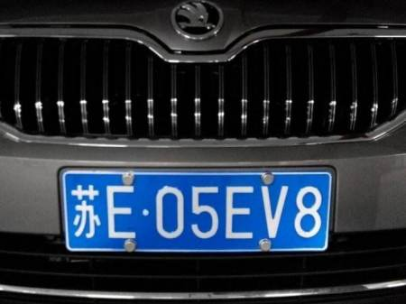

# Hyper LPR 模块
使用python flask完成的车牌识别系统。

## 环境安装
```
python3 -m pip install -i https://mirrors.aliyun.com/pypi/simple/ -r requirements.txt
```

## Docker编译运行
```
docker build . -t lpr
docker run -d --name lpr -p 8080:8080 lpr
```

## curl测试
```bash
curl --location --request POST 'http://127.0.0.1:8080' \
--header 'Content-Type: image/jpeg' \
--data-binary '@1.jpeg'
```

### 结果
```json
[["苏E05EV8", 0.9692950674465725, [47, 149, 344, 255]]]
```
如果识别成功返回数组格式
```json
[[车牌,置信度，[left,top,right,bottom]]]
```
